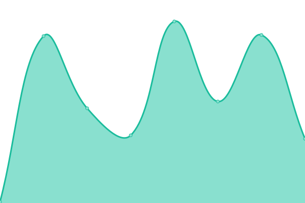
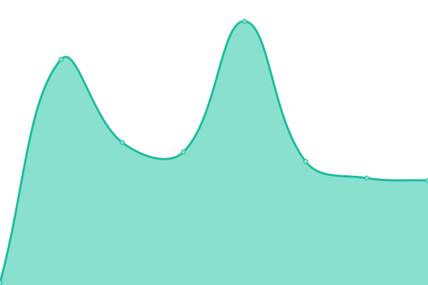
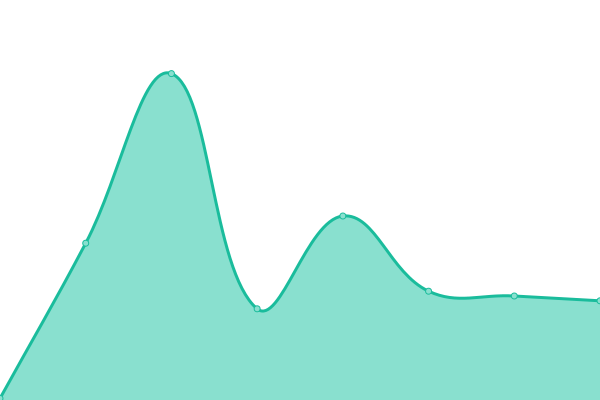

# [📈 Live Status](https://BinPar.github.io/emp-status): <!--live status--> **🟧 Partial outage**

This repository contains the open-source uptime monitor and status page for [BinPar](http://www.binpar.com), powered by [Upptime](https://github.com/upptime/upptime).

With [Upptime](https://upptime.js.org), you can get your own unlimited and free uptime monitor and status page, powered entirely by a GitHub repository. We use [Issues](https://github.com/BinPar/emp-status/issues) as incident reports, [Actions](https://github.com/BinPar/emp-status/actions) as uptime monitors, and [Pages](https://BinPar.github.io/emp-status) for the status page.

<!--start: status pages-->
<!-- This summary is generated by Upptime (https://github.com/upptime/upptime) -->
<!-- Do not edit this manually, your changes will be overwritten -->
<!-- prettier-ignore -->
| URL | Status | History | Response Time | Uptime |
| --- | ------ | ------- | ------------- | ------ |
|  [EMP - ES](https://www.medicapanamericana.com/es) | 🟥 Down | [emp-es.yml](https://github.com/BinPar/emp-status/commits/HEAD/history/emp-es.yml) | 

 464ms
     
 | 

<a href="https://BinPar.github.io/emp-status/history/emp-es">99.99%</a>
    

|  [EMP - CO](https://www.medicapanamericana.com/co) | 🟥 Down | [emp-co.yml](https://github.com/BinPar/emp-status/commits/HEAD/history/emp-co.yml) | 

 100ms
     
 | 

<a href="https://BinPar.github.io/emp-status/history/emp-co">99.99%</a>
    

|  [EMP - MX](https://www.medicapanamericana.com/mx) | 🟥 Down | [emp-mx.yml](https://github.com/BinPar/emp-status/commits/HEAD/history/emp-mx.yml) | 

 46ms
     
 | 

<a href="https://BinPar.github.io/emp-status/history/emp-mx">100.00%</a>
    

|  [EMP - AR](https://www.medicapanamericana.com/ar) | 🟩 Up | [emp-ar.yml](https://github.com/BinPar/emp-status/commits/HEAD/history/emp-ar.yml) | 

 47ms
     
 | 

<a href="https://BinPar.github.io/emp-status/history/emp-ar">100.00%</a>
    

|  [EMP - US](https://www.medicapanamericana.com) | 🟩 Up | [emp-us.yml](https://github.com/BinPar/emp-status/commits/HEAD/history/emp-us.yml) | 

 84ms
     
 | 

<a href="https://BinPar.github.io/emp-status/history/emp-us">100.00%</a>
    

<!--end: status pages-->

[**Visit our status website →**](https://BinPar.github.io/emp-status)

## 📄 License

- Powered by: [Upptime](https://github.com/upptime/upptime)
- Code: [MIT](./LICENSE) © [BinPar](http://www.binpar.com)
- Data in the `./history` directory: [Open Database License](https://opendatacommons.org/licenses/odbl/1-0/)
